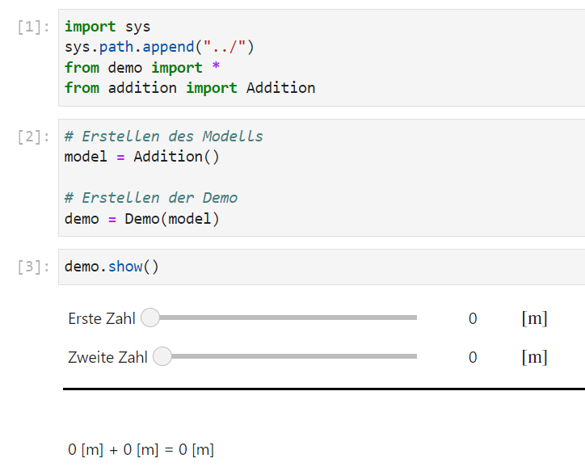

# Anleitung

**Autor**: Leo Halbritter - Studentischer Mitarbeiter TU Wien

## Voraussetzungen

Um die Modelle lokal auszuführen, sind die folgenden Tools notwendig:

- [Anaconda 3](https://www.anaconda.com)

### Windows

Ist die Anaconda Installation abgeschlossen muss nun unter Windows die *Anaconda Prompt* ausgeführt werden. In dieser kann ganz normal über den *cd \<path\>* Befehl in den Projekt-Ordner *hydraulics-models* navigiert werden. Das sollte dann in etwa so aussehen:


### Linux

Unter Linux kann das normale Terminal gestartet werden und die *Anaconda Umgebung base* sollte automatisch aktiv sein.

### Umgebung installieren

In dem Projekt-Ordner sollte ein File mit dem Namen *environment.yml* zur Verfügung stehen. Die Umgebung *hydraulics* lässt sich einfach mit dem Befehl `conda env create -f environment.yml` installieren. Nach korrekter Ausführung sollte nun über den Befehl `conda activate hydraulics` die neue Umgebung aktiviert werden können. Ob das ganze erfolgreich war ist sichtbar anhand des Umgebungsnamen ganz links. Zeigt dieser *(hydraulics)* an, war die Installation erfolgreich.


## Benutzung

Die Modelle sind als Hilfestellung für Lehrveranstaltungen mit Laborbetrieb gedacht. Sie sollen den Laborbetrieb simulieren. Um die Modelle lokal zu benutzen muss vorerst die unter **Voraussetzungen** erklärte Installation durchgeführt werden und dann folgende Schritte in dem Anaconda Fenster abgelaufen werden:

- **Umgebung aktivieren**: `conda activate hydraulics`
- **Zum Projekt-Ordner navigieren**: `cd pfad/zu/projekt/hydraulics_models`
- **Applikation starten**: `voila --enable_nbextensions=True`

Der letzte Schritt startet mit der Applikation auch den Standard-Browser des Systems. Es sollte nun eine Seite angezeigt werden, die drei Ordner mit den Namen:

- *ElasticAngle_Model* - Hier kann das Mechanik-Modell zum elastischen, starren Winkel simuliert werden
- *Pipe_Model* - Hier kann das Hydraulik-Modell zu einer reibungslosen Röhre simuliert werden
- *Tank_Model* - Hier kann das Hydraulik-Modell zu einem Wassertank mit Löchern simuliert werden

In jedem dieser Ordner befindet sich jeweils ein ".ipynb" File, welches jeweils ein Modell simuliert. Ein Klick auf eines der Files startet die jeweilige Simulation.

### Jupyter Lab

Während der `voila` Befehl nur die Applikation ohne Anzeige des Codes startet, wird mit dem Befehl `jupyter lab` eine grafische Oberfläche ausgeführt, in der der Code bearbeitet werden kann. Es empfiehlt sich neu geschriebene Funktionalitäten in der `jupyter lab` Umgebung zu testen, bevor diese in der Applikation übernommen werden.

## Modellierung

Wollen Sie nun selbst ein Modell in eine `jupyter` Applikation einbinden, so eignet sich der folgende Workflow:

### 1. Grundfunktionalität implementieren

Bevor es an die grafische Darstellung geht ist es sinnvoll zunächst einmal die Grundfunktionalität zu implementieren. Am Besten wie in der bisherigen Projektstruktur einen neuen Ordner mit dem Namen 'Modellname_Model' anlegen und dort ein neues python file mit dem Namen 'Modellname.py' anlegen. Um die Arbeit möglichst einheitlich zu gestalten empfiehlt es sich zunächst einmal alle Funktionen und Klassen der `demo.py` Bibliothek zu importieren und das Modell als Klasse zu implementieren, welche von `Model` erbt. Dazu einfach folgenden Code in das neue python file kopieren:

```python
from demo import *

class ModellName(Model):
    # Hier kommt der Code für das Modell
```

Nun ist es unbedingt notwendig zumindest die Methode `calculate` zu implementieren, welche einen String zurückgibt, der die Berechnung des Modells enthält. Diese Methode wird intern ausgeführt und zeigt das Ergebnis in der Applikation an.

**Beispiel:**

```python
from demo import *

class Addition(Model):
    # Ein Modell, welches zwei Zahlen addiert
    def calculate(self):
        return f"{self.a} + {self.b} = {self.a + self.b}"
```

### 2. Grafische Oberfläche implementieren

Damit die Nutzer:innen nun auch die Möglichkeit haben das Modell zu bedienen, muss eine grafische Oberfläche implementiert werden. Es empfiehlt sich hierfür das von `demo` bereitgestellte `Changeable` Framework zu verwenden. In diesem Framework finden sich viele Implementierungen von Widgets, welche die Nutzer:innen angezeigt bekommen. Sehr häufig verwendete Beispiele dieser Widgets wären unter anderem:

- 'IntChangeable' - Ein Slider, der die Eingabe einer ganzen Zahl ermöglicht
- 'FloatChangeable' - Ein Slider, der die Eingabe einer Fließkommazahl ermöglicht
- 'DropdownGroup' - Ein Dropdown-Menü, welches die Auswahl zwischen mehreren Optionen ermöglicht
- 'ClickButton' - Ein Button, welcher bei einem Klick eine Funktion ausführt
- 'HorizontalSpace' - Ein Objekt um einen horizontalen Abstand einzufügen

Es ist wichtig, dass vor der Implementierung geplant wird, welche Eingaben von den Nutzer:innen erfolgen und welche Eingaben statisch sind. Sind die dynamischen Eingaben klar, kann wie folgt vorgegangen werden:

```python
from demo import *

class Addition(Model):
    # Ein Modell, welches zwei Zahlen addiert
    
    def __init__(self):
        self.a = IntChangeable(
            0, # Startwert
            0, # Exponent der Einheit
            "m", # Einheit
            0, # Minimalwert
            10, # Maximalwert
            "Erste Zahl", # Beschreibung,
            step=1 # Schrittweite
        )
        self.b = IntChangeable(0, 0, "m", 0, 10, "Zweite Zahl", step=1)
        
        # Dieser Schritt ist sehr wichtig, um die Eingaben später an die Simulation zu übergeben
        self.params = [ChangeableContainer([self.a, self.b])]
    
    def calculate(self):
        return f"{self.a} + {self.b} = {self.a + self.b}"
```

In diesem Beispiel werden zwei `IntChangeable` Objekte erstellt, welche die Eingabe einer ganzen Zahl ermöglichen. Im letzten Schritt wird ein sogenannter 'ChangeableContainer' erstellt, der die beiden Eingaben enthält. Dieser Container ist notwendig, damit die Eingaben im nächsten Schritt an die Simulation weitergegeben werden. Es ist wichtig, dass das Attribut `params` heißt und eine Liste an `ChangeableContainer`s enthält, da jedes Listenelement eine neue Spalte in der Applikation darstellt.


### 3. Simulation in die Applikation einbinden

Als letzter Schritt muss nun die `jupyter` Applikation erstellt werden. Dazu am Besten im selben Ordner des Modells ein neues jupyter notebook file anlegen. Am einfachsten geht das, wenn vorher in dem Modellordner die `jupyter lab` Umgebung gestartet wird und dann in der grafischen Oberfläche ein neues Notebook erstellt wird.

In diesem Notebook wird nun der Code für die Applikation geschrieben. Dazu muss zunächst die Bibliothek `demo` importiert werden. Das ist im Notebook etwas komplizierter als in einem normalen python file, da die Bibliothek nicht im `sys.path` ist. Dazu muss folgender Code in einer eigenen Zelle ausgeführt werden:

```python
import sys
sys.path.append("../")
from demo import *
# Das Modell muss auch noch importiert werden
from Modellname import Modellname
```

Jetzt ist es gar nicht mehr schwierig die Applikation einzubinden. Dazu muss lediglich ein `Model`, sowie ein `Demo` Objekt erstellt werden.
In dem Beispiel der Addition sieht das wie folgt aus:

```python
# Erstellen des Modells
model = Addition()

# Erstellen der Demo
demo = Demo(model)

# ---------------- Neue Zelle --------------- #
demo.show()
```

In der ersten Zelle werden alle notwendigen Objekte erstellt und in der zweiten Zelle wird die Applikation gestartet. Das `Demo` Objekt extrahiert automatisiert die Parameter des Modells und erstellt anhand des `ChangeableContainer`s die grafische Oberfläche. Die Ausgabe der Ergebnisse erfolgt über die `calculate` Methode im Model, welche beim Ändern eines beliebigen `Changeable` Objekts neu berechnet wird. Die Methode `show()` startet die Applikation und zeigt diese an. Wurden die Schritte bis jetzt korrekt ausgeführt, sollte die Applikation wie folgt aussehen:



Wie Sie sehen, ist das Notebook so sehr klein gehalten. Die Eingaben sind nun untereinander aufgelistet, das lässt sich sehr einfach ändern, indem die `params` Liste in der `Addition` Klasse um ein weiteres `ChangeableContainer` Objekt erweitert wird. Das Ergebnis sieht dann wie folgt aus:

```python
# Addition.__init__(self)
self.params = [
    ChangeableContainer([self.a]),
    ChangeableContainer([self.b])
]
```

So werden die Eingaben nebeneinander angezeigt:


*Tipp: Damit die 'Zweite Zahl' nicht so nah an der Einheit der 'Erste Zahl' Eingabe steht, kann noch zusätzlich ein `HorizontalSpace` Objekt in einem weiteren ChangeableContainer dazwischen eingefügt werden.*

### 4. Visualisierung (Optional)

Die Applikation kann auch mit einer visuellen Darstellung in 2D und/oder 3D erweitert werden. Für die Visualisierung werden die Bibliotheken

- `matplotlib` - Für das Darstellen von mathematischen Funktionen ([Dokumentation](https://matplotlib.org/))
- `ipycanvas` - Für das Zeichnen von geometrischen Objekten ([Dokumentation](https://ipycanvas.readthedocs.io/en/latest/))
- `pythreejs` - Für das Rendern von 3D Objekten ([Documentation](https://pythreejs.readthedocs.io/en/stable/))

verwendet. Ein Demo-Objekt nimmt als optionalen Parameter ein `drawable` Objekt an, welches am Besten mit einer `widgets.HBox` erstellt wird. Die `widgets.HBox` ist eine Box, welche die Widgets horizontal anordnet. Die Widgets können entweder `pythreejs.Renderer`, `ipycanvas.canvas.Canvas` oder
`matplotlib.pyplot.figure.canvas` Objekte sein.

#### Visualisierung mit ipycanvas

Um eine grafische Darstellung in der zweiten Dimension des Modells zu erstellen, ist das `ipycanvas` Objekt `Canvas` sehr gut geeignet. Dieses Objekt bietet eine Art Zeichenfläche mit der angegebenen Größe an, welche dann mit geometrischen Objekten gefüllt werden kann. Es ist empfehlenswert das `Canvas` Objekt direkt im Notebook zu erstellen und dem Modell zu übergeben, da so die Größe des Canvas Objekts direkt im Notebook angepasst werden kann. Das `Canvas` Objekt kann dann als `drawable` Objekt an das `Demo` Objekt übergeben werden.

```python
# Importieren des canvas Moduls der ipycanvas Bibliothek
from ipycanvas import canvas

# ---------------- Neue Zelle --------------- #
# Erstellen des Canvas Objekts mit Größe 500x500 Pixel
canv = canvas.Canvas(width=500, height=500)
# Erstellen des Modells
model = Addition(canvas=canv)
# Erstellen der Demo
demo = Demo(model, drawable=canv)

# ---------------- Neue Zelle --------------- #
demo.show()
```
*Hinweis: Die Addition Klasse muss um das `canvas` Attribut erweitert werden.*

Bei Ausführung der `demo.show()` Zelle sollte nun quasi ein großer Abstand zwischen den Eingaben und der Ausgabe entstanden sein. Das ist
natürlich die leere Zeichenfläche, die dazwischen liegt. Ein Modell hat immer den Aufbau:

- **Eingaben**
- **drawables**
- **Ausgabe**

Die Zeichnungen auf der Zeichenfläche sollten im Modell erfolgen, da dort der direkte Zugriff auf die Eingaben besteht. Es empfiehlt sich eine `draw()` Methode zu erstellen, um die Zeichnungen zu steuern. Um sicherzustellen, dass auch die visuelle Darstellung auf die Änderungen der Eingaben reagiert, kann die `update()` Methode von `Model` überschrieben werden. Diese sollte dann so aussehen:

```python
class Addition(Model):
    def update(self, change):
        # update Methode der Superklasse aufrufen, damit die Grundfunktionalität nicht verloren geht
        super().update(change)
        # Zeichnungen aktualisieren
        self.draw()

    def draw(self):
        # Es soll nur gezeichnet werden, wenn es etwas zum bezeichnen gibt
        if self.canvas is None:
            return
        # Zeichnungen erstellen...
```

Mit diesen Änderungen wird die `draw()` Methode bei jeder Eingabenänderung aufgerufen. Für die Zeichnungen selbst empfiehlt es sich die [ipycanvas Dokumentation](https://ipycanvas.readthedocs.io/en/latest/) zu lesen. Wichtig ist es den `draw()` Block immer mit `self.canvas.clear()` zu beginnen, da sonst die Zeichnungen übereinander gelegt werden. Die `draw()` Methode sollte dann so aussehen:

```python
class Addition(Model):
    def draw(self):
        # Es soll nur gezeichnet werden, wenn es etwas zum bezeichnen gibt
        if self.canvas is None:
            return
        # Zeichenfläche leeren
        self.canvas.clear()

        # Die stroke_rect(x, y, sx, sy) Methode zeichnet ein leeres Rechteck mit der linken oberen Ecke an (x, y) und der Größe (sx, sy)
        self.canvas.stroke_rect(10, 10, 200, 50)
        self.canvas.stroke_rect(10, 80, 200, 50)
        self.canvas.stroke_rect(10, 150, 400, 50)

        # Die fill_text(text, x, y) Methode zeichnet den Text text an die Position (x, y)
        self.canvas.fill_text("a: ", 5, 5)
        self.canvas.fill_text("b: ", 5, 75)
        self.canvas.fill_text("Sum: ", 5, 145)

        # Die fill_rect(x, y, sx, sy) Methode zeichnet ein gefülltes Rechteck mit der linken oberen Ecke an (x, y) und der Größe
        # Das fill_style Attribut setzt die Füllfarbe und kann als hexcode oder als Farbname angegeben werden
        self.canvas.fill_style = "red"
        self.canvas.fill_rect(10, 10, self.a.real() * 20, 50)

        self.canvas.fill_style = "green"
        self.canvas.fill_rect(10, 80, self.b.real() * 20, 50)

        self.canvas.fill_style = "blue"
        self.canvas.fill_rect(10, 150, (self.a + self.b).real() * 20, 50)
        self.canvas.fill_style = "black"
```
*Hinweis: Mit Changable.real() kann der Wert eines Changable Objekts als `float` ausgelesen werden.*

Damit die Demo gleich am Anfang mit einer visuellen Darstellung gezeigt wird, sollte die folgende Zeile vor dem `demo.show()` Aufruf eingefügt werden: `canv.on_client_ready(model.draw)`. Das sagt dem `Model` Objekt, dass die `draw()` Methode aufgerufen werden soll, wenn das `Canvas` Objekt vollständig geladen ist (nur so funktioniert auch die voila Darstellung sauber). Die Demo sollte nun so aussehen:


Jetzt gibt es natürlich einen großen Abstand zwischen der grafischen und textuellen Ausgabe. Dazu sollte die Größe des Canvas Objekts angepasst werden. Dank der Implementierung wissen wir, dass die Ausgabe immer maximal 400 Pixel breit ist. Die Höhe der Ausgabe ist ebenfalls höchstens 200 Pixel, da so die Balken platziert wurden. Die Zeichenfläche sollte also auf 410x210 Pixel angepasst werden.

Mithilfe einer `ipywidgets.HBox` können beliebig viele Canvas Objekte nebeneinander angeordnet werden. Zum Beispiel könnte man dreimal den gerade erzeugten Canvas einfügen, was zu dieser Ausgabe führt:


Ähnlich können auch die anderen Visualisierungsarten implementiert werden. Am wichtigsten ist es, das drawable Attribut der Demo zu setzen. Für weitere Informationen zur Implementierung von 3D Visualisierungen und mathematischen Plots sehen Sie sich bitte die entsprechenden Dokumentationen an:

- [matplotlib](https://matplotlib.org/)
- [pythreejs](https://pythreejs.readthedocs.io/en/stable/)