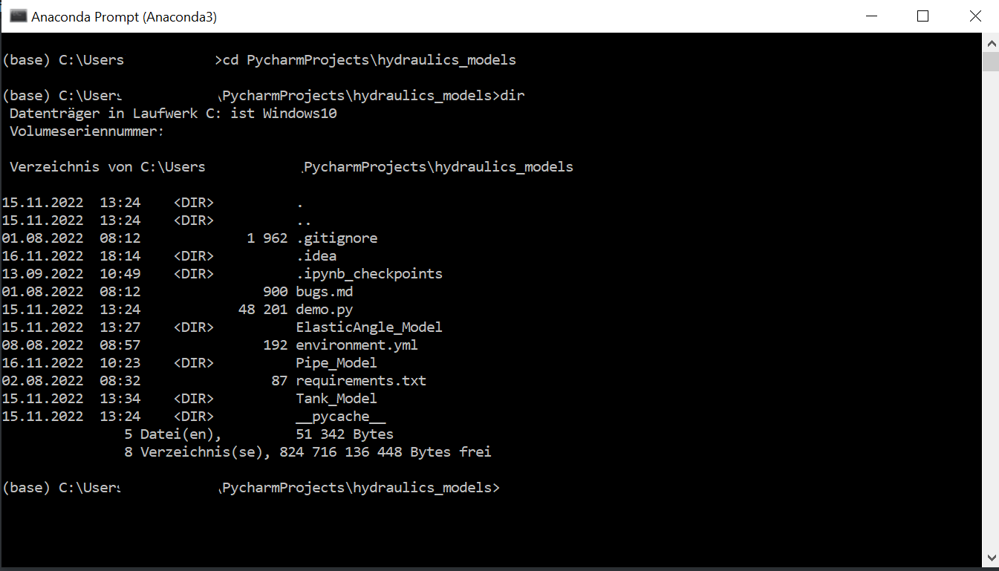
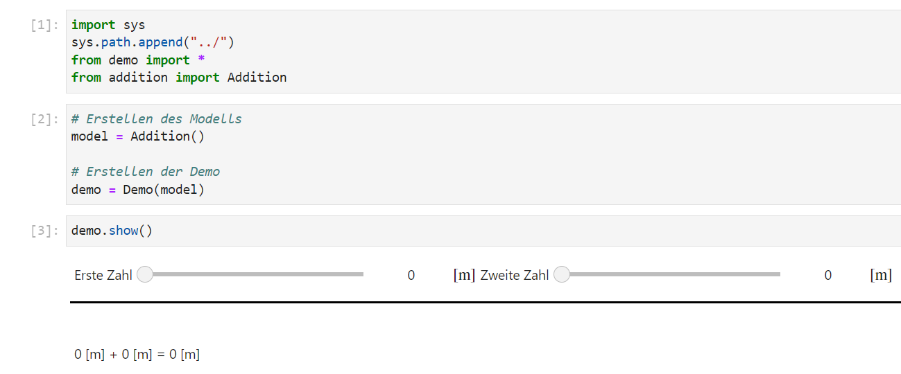
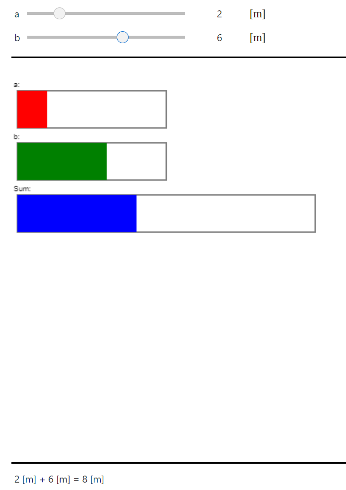
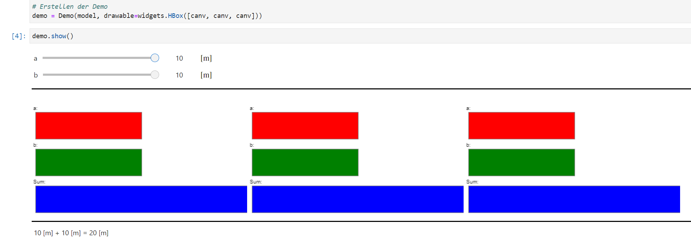

# Manual

**Author**: Leo Halbritter - Student Employee TU Wien

## Requirements

To execute the models locally the following tool must be installed:

- [Anaconda 3](https://www.anaconda.com)

### Windows

After finishing the installation of Anaconda you should now execute the *Anaconda Prompt* in Windows. In this console you can navigate to the projects directory *hydraulics-models* via `cd <path>` as usual. This is how it should look:



### Linux

In Linux just run the terminal of your distribution and the *Anaconda environment base* should automatically be active.

### Create environment

In the project folder you should see a file with the name *environment.yml*. This file will install the *hydraulics* environment by executing the command `conda env create -f environment.yml`. After doing so the command `conda activate hydraulics` will change the active environment from *base* to the newly created *hydraulics* environment. You can validate your steps by checking the name of the environment on the left in the brackets as shown right here:


## Usage

The models have been programmed to support courses with lab practices. They simulate some of the lab processes. To use these models locally first follow the steps of the **Requirements** section above, then follow these steps in your anaconda console:

- **Activate environment**: `conda activate hydraulics`
- **Navigate to project**: `cd path/to/hydraulics_models`
- **Start application**: `voila --enable_nbextensions=True`

This last step starts the application as well as the default browser of your operating system. In your browser you should see a page with three folders, containing:

- *ElasticAngle_Model* - Here you can simulate the mechanics model of the elastic, static angle
- *Pipe_Model* - Here you can simulate the hydraulics model of a frictionless pipe
- *Tank_Model* - Here you can simulate the hydraulics model of a water tank with holes

Inside each of these folders there is a ".ipynb" file, which simulates the model. Just click on one of those files and the simulation starts.

### Jupyter Lab

While the `voila` command only starts the application without showing any code, you can also execute the command `jupyter lab` to get a graphical view where code can be edited. It is recommended to test newly implemented functionalities in the `jupyter lab` environment before including them in the application.

## Modeling

If you want to implement your own model as an `jupyter` application you can follow this workflow:

### 1. Implement basic functionality

Now before you can show the user some visualizations you first need to implement the base functionality of your model. First create a new directory with the name 'Modelname_Model' and inside of the new directory create a python file with the name 'modelname.py'. In this file you want to import everything from the `demo.py` library of the project. The model can then be implemented as a subclass of `Model` which is a class from the `demo` library. To do so, copy this code into your newly created file:

```python
from demo import *

class Modelname(Model):
    # Insert code for the model
```

Now it is necessary that you at least implement the `Model.calculate()` function which returns a String containing the calculations of the model. This method will be executed automatically and shows the result in the application.

**Take a look at this example:**

```python
from demo import *

class Addition(Model):
    # This model adds two numbers together
    def calculate(self):
        return f"{self.a} + {self.b} = {self.a + self.b}"
```

### 2. Implement user interface

To give users the possibility to interact with the model, an user interface must be implemented. To do that the `demo` library also provides a `Changeable` Framework, which offers a lot of common widgets, including:

- 'IntChangeable' - A slider, which provides integer input
- 'FloatChangeable' - A slider, which provides floating numbers input
- 'DropdownGroup' - A dropdown menu, which provides a choice between different options
- 'ClickButton' - A Button, which executes a function on click
- 'HorizontalSpace' - An object which adds horizontal space

It is important to plan which inputs will be part of the user's input and which values need to be static. If you have decided on the model's dynamic inputs you can start creating `Changeable`s in your model class:

```python
from demo import *

class Addition(Model):
    # This model adds two numbers together
    
    def __init__(self):
        self.a = IntChangeable(
            0, # Initial value
            0, # Power of unit
            "m", # Unit
            0, # Minimum value
            10, # Maximum value
            "Erste Zahl", # Description,
            step=1 # Step size
        )
        self.b = IntChangeable(0, 0, "m", 0, 10, "Zweite Zahl", step=1)
        
        # This step is necessary to later on tell the demo which inputs there are
        self.params = [ChangeableContainer([self.a, self.b])]
    
    def calculate(self):
        return f"{self.a} + {self.b} = {self.a + self.b}"
```

In this example two `IntChangeable` objects are created. The last step initializes a `ChangeableContainer` list, which is necessary to give the user inputs to the simulation in the next step. It is required, that the attribute's name is `params` and that the attribute is a list of `ChangeableContainer`s (even when you only have one container), because each list element represents a column in your application.

### 3. Implement simulation

At last you need to create the jupyter application. To do that start the `jupyter lab` environment in the model's directory. Now press on the big plus button on the top left of the page and choose 'Python 3 (ipykernel)' under *Notebook*. This creates a new notebook with no name. To name it, simply press CTRL+S and save it with the correct name.

In this newly created notebook the code of the application will be written. First you need to import the `demo` library again. This is a bit more complex in the notebook than it is in a normal python file, since the library is not contained in the `sys.path`. Just copy the following code into a new cell of the notebook:

```python
import sys
# This line adds the outer directory to the system path
sys.path.append("../")
from demo import *
# The model also needs to be imported
from modelname import Modelname
```

Now you can easily implement the application. Just create a new object of the `Model` and give it to the `Demo` Object while creating it. This can look like this:

```python
# Create model
model = Addition()

# Create demo
demo = Demo(model)

# ---------------- New cell --------------- #
demo.show()
```

In the first cell you create the relevant object and the second cell starts the application. The `Demo` object automatically pulls the `params` attribute of the model and creates the user interface from it. The output of the results are received by calling the `calculate` function of the model. Each change by the user recalculates the output results. The `show()` method starts the application and displays it in the notebook. The example should look like this:


Now the notebook itself is rather small in comparison to the model's code. That is because the `Demo` class implements all the repetitive parts of building a model, which would normally be the code of the notebook. The input widgets are now shown in two rows, this can be changed by adding another `ChangeableContainer` to the `params` attribute in the `Addition` class. This can be implemented like here:

```python
# Addition.__init__(self)
self.params = [
    ChangeableContainer([self.a]),
    ChangeableContainer([self.b])
]
```

Then the input widgets will be next to each other in one row:



*Tip: You can add more space between the two input widgets, by adding yet another ChangeableContainer with a `HorizontalSpace` object.*

### 4. Visualization (Optional)

The application can be extended with a visualization in 2D and/or 3D. For this the following libraries have been used:

- `matplotlib` - For plotting mathematical functions ([Documentation](https://matplotlib.org/))
- `ipycanvas` - For drawing geometry ([Documentation](https://ipycanvas.readthedocs.io/en/latest/))
- `pythreejs` - For rendering 3D models ([Documentation](https://pythreejs.readthedocs.io/en/stable/))

A `Demo` object takes an optional parameter named `drawable`, which should preferably be a `widgets.HBox`. A `widgets.HBox` is a box, which aligns widgets horizontally. Those widgets can either be `pythreejs.Renderer`, `ipycanvas.canvas.Canvas` or `matplotlib.pyplot.figure.canvas` objects.

#### ipycanvas visualization

To create a visualization in the second dimension you should create a `Canvas` object of the `ipycanvas` library. This object represents a canvas with the given size. It is recommended to define the `Canvas` object directly in the notebook, so the size of the Canvas can be adjusted faster. The `Canvas` object should then be given to the `Demo` object as the `drawable` attribute.

```python
# Importing the canvas module from the ipycanvas library
from ipycanvas import canvas

# ---------------- New Cell --------------- #
# Creating the Canvas object with size of 500x500 pixels
canv = canvas.Canvas(width=500, height=500)
# Creating the Model and giving the canvas
model = Addition(canvas=canv)
# Creating the Demo with model and drawable
demo = Demo(model, drawable=canv)

# ---------------- New Cell --------------- #
demo.show()
```
*Note: The Addition class needs to be extended with a `canvas` attribute.*

When executing the `demo.show()` cell now there should be a big space between input and output. This is the empty canvas, which was put between. A demo always follows this layout:

- **Input**
- **drawables**
- **Output**

The logic for the drawings should be done in the model's class as it has direct access to the input parameters. It is recommended to write a `draw()` function to control drawings. To be sure, that the visualization also reacts to new inputs, the `update()` method of the model should be overridden. It should look like this:

```python
class Addition(Model):
    def update(self, change):
        # Execute superclass's update method to include original functionality
        super().update(change)
        # Execute draw method
        self.draw()

    def draw(self):
        # Drawings should only be executed if we have a canvas
        if self.canvas is None:
            return
        # Create drawings
```

Thanks to these changes the `draw()` method will now be executed each time a new input is received. For the drawings themself it is recommended to read into the [ipycanvas Documentation](https://ipycanvas.readthedocs.io/en/latest/). It is important to always start the `draw()` function with the `self.canvas.clear()` line, because otherwise all future drawings would overlap all past drawings. The `draw()` function should then look like something like this example:

```python
class Addition(Model):
    def draw(self):
        # Drawings should only be executed if we have a canvas
        if self.canvas is None:
            return
        # Clear canvas
        self.canvas.clear()

        # stroke_rect(x, y, sx, sy) draws an empty rectangle with the left upper corner at (x, y) and size (sx, sy)
        self.canvas.stroke_rect(10, 10, 200, 50)
        self.canvas.stroke_rect(10, 80, 200, 50)
        self.canvas.stroke_rect(10, 150, 400, 50)

        # fill_text(text, x, y) draws the text 'text' at (x, y)
        self.canvas.fill_text("a: ", 5, 5)
        self.canvas.fill_text("b: ", 5, 75)
        self.canvas.fill_text("Sum: ", 5, 145)

        # fill_rect(x, y, sx, sy) draws an filled rectangle with the left upper corner at (x, y) and size (sx, sy)
        # fill_style sets the fill color to the specified color in hexcode or name
        self.canvas.fill_style = "red"
        self.canvas.fill_rect(10, 10, self.a.real() * 20, 50)

        self.canvas.fill_style = "green"
        self.canvas.fill_rect(10, 80, self.b.real() * 20, 50)

        self.canvas.fill_style = "blue"
        self.canvas.fill_rect(10, 150, (self.a + self.b).real() * 20, 50)
        self.canvas.fill_style = "black"
```
*Note: Changable.real() returns the float value of a Changeable object.*

To secure initial execution of the model's draw method one needs to include the line `canv.on_client_ready(model.draw)` before the `demo.show()` call. This tells the `Model` object to execute their `draw()` function, as soon as the `Canvas` object has been fully initialized (only by including this will the voila site work correctly). The example now looks like this:



Because of the excess size in our canvas object there is a huge distance between the drawing and the results. This can be fixed by taking a look at the implementation and fitting the canvas's size to the drawings' size. As we can see, the bars will always be at a maximum width of 400 pixels. The height of the drawing can be calculated by adding the y-position to the y-size of the lowest bar together. This gives us a height of 200 pixels. Now we can adjust the canvas's size to something like 410x210 pixels.

An `ipywidgets.HBox` can be used to show multiple drawables. For example you could add the canvas three times, which results in this output:



Just like that any visualization can be implemented, as long as it is jupyter lab compatible. The most important part is to set the drawable attribute of the demo. For further information to implementing 3D Visualization and mathematical plots please follow these links:

- [matplotlib](https://matplotlib.org/)
- [pythreejs](https://pythreejs.readthedocs.io/en/stable/)