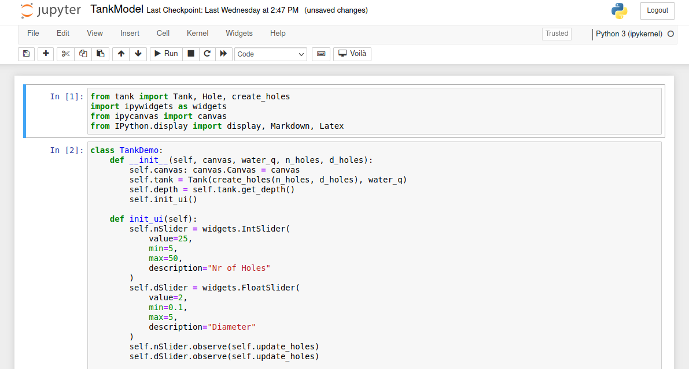
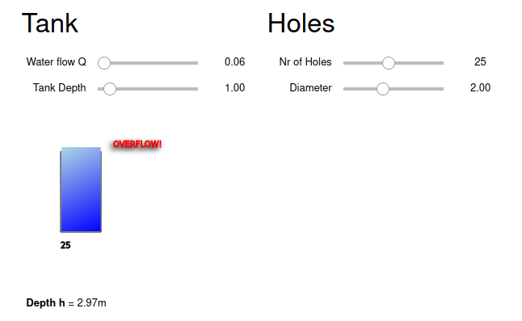

# Tank Model - Instructions

This is a demonstration of a punctured tank getting filled with with water at a variable water flow.

## Requirements

#### a) Online Usage

- Functional Web Browser (i.e. firefox, chrome)

#### b) Local Usage

- [Python 3.x](https://www.python.org/downloads/) (Project has been tested on Python 3.9.2)

## Usage

Notebook available under [TODO: Link to deployed notebook](#).

Execute locally by following these commands:

```python
pip install -r requirements.txt
jupyter notebook TankModel.ipynb
```

This should open the notebook automatically in your browser. 



Now if you press `SHIFT + ENTER` or the `Run` Button above three times, you should be able to see the Demo, like this:



